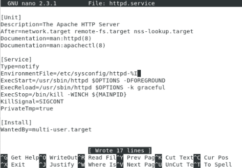
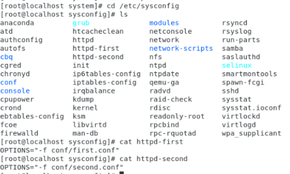

# Отчет по лабораторной работе 1

## Задание 1

Написать сервис, который будет раз в 30 секунд мониторить лог на предмет наличия ключевого слова. Файл и слово должны задаваться в /etc/sysconfig

### Создадим файл с конфигурацией сервиса в /etc/sysconfig

```bash
[root@centos7-vm sysconfig]\# ls -l
...
-rw-r--r--. 1 root root   39 Dec 11 19:49 watchlog
[root@centos7-vm sysconfig]\# vim watchlog
WORD="ALERT"
LOG=/var/log/watchlog.log
```
```bash
milkolad@milkolad:/etc/sysconfig$ ls -l
итого 4
-rw-r--r-- 1 root root 39 дек 24 14:24 watchlog
```

### Создаем файл /var/log/watchlog.log

```bash
sudo touch /var/log/watchlog.log
milkolad@milkolad:/etc/sysconfig$ cd /var/log
milkolad@milkolad:/var/log$ ls -l
итого 5988
-rw-r--r--  1 root              root               9435 дек 24 13:42 alternatives.log
-rw-r--r--  1 root              root              54638 ноя 30 14:48 alternatives.log.1
drwxr-x---  2 root              adm                4096 дек 24 12:20 apache2
-rw-r-----  1 root              adm                 859 дек 24 12:31 apport.log
-rw-r-----  1 root              adm                 115 дек 18 20:10 apport.log.1
-rw-r-----  1 root              adm                 120 дек 11 20:42 apport.log.2.gz
-rw-r-----  1 root              adm                 122 дек 10 21:25 apport.log.3.gz
-rw-r-----  1 root              adm                 121 дек  4 23:30 apport.log.4.gz
-rw-r-----  1 root              adm                 505 ноя 30 19:36 apport.log.5.gz
-rw-r-----  1 root              adm                 295 ноя 28 18:21 apport.log.6.gz
-rw-r-----  1 root              adm                 122 ноя 24 16:21 apport.log.7.gz
drwxr-xr-x  2 root              root               4096 дек 24 13:47 apt
drwxr-xr-x  2 root              root               4096 дек 24 13:46 atop
-rw-r-----  1 syslog            adm                6167 дек 24 14:26 auth.log
-rw-r-----  1 syslog            adm              125505 дек 24 12:17 auth.log.1
-rw-r-----  1 syslog            adm                2236 дек 16 16:22 auth.log.2.gz
-rw-r-----  1 syslog            adm                6417 дек 10 17:07 auth.log.3.gz
-rw-r-----  1 syslog            adm                7613 дек  2 11:36 auth.log.4.gz
-rw-------  1 root              root             126110 ноя 16 23:17 boot.log
-rw-r--r--  1 root              root              56751 авг  5 21:59 bootstrap.log
-rw-rw----  1 root              utmp                  0 дек  1 11:29 btmp
-rw-rw----  1 root              utmp                  0 авг  5 21:58 btmp.1
drwxr-xr-x  2 root              root               4096 дек 24 12:20 cups
drwxr-xr-x  2 root              root               4096 июн 19  2019 dist-upgrade
-rw-r--r--  1 root              root             249152 дек 24 13:47 dpkg.log
-rw-r--r--  1 root              root            2018534 ноя 30 14:48 dpkg.log.1
-rw-r--r--  1 root              root              32032 дек 18 18:27 faillog
-rw-r--r--  1 root              root               5965 дек 18 17:37 fontconfig.log
drwx--x--x  2 root              gdm                4096 фев 19  2019 gdm3
-rw-r--r--  1 root              root               1241 дек 24 12:15 gpu-manager.log
drwxrwxr-x  3 root              root               4096 ноя 14 11:03 installer
drwxr-sr-x+ 3 root              systemd-journal    4096 ноя 14 11:05 journal
-rw-r-----  1 syslog            adm               11874 дек 24 14:17 kern.log
-rw-r-----  1 syslog            adm             1147433 дек 24 12:17 kern.log.1
-rw-r-----  1 syslog            adm               69215 дек 16 16:22 kern.log.2.gz
-rw-r-----  1 syslog            adm              190351 дек 10 17:04 kern.log.3.gz
-rw-r-----  1 syslog            adm              300380 дек  2 11:37 kern.log.4.gz
-rw-rw-r--  1 root              utmp             292292 дек 18 18:27 lastlog
drwxr-x---  2 mysql             adm                4096 дек 18 18:27 mysql
drwxr-xr-x  2 root              adm                4096 дек 24 12:20 nginx
-rw-------  1 root              root                 56 дек 24 12:20 php7.2-fpm.log
-rw-------  1 root              root               8851 дек 24 12:15 php7.2-fpm.log.1
drwx------  2 speech-dispatcher root               4096 апр 23  2018 speech-dispatcher
-rw-r-----  1 syslog            adm               83527 дек 24 14:23 syslog
-rw-r-----  1 syslog            adm              632416 дек 24 12:20 syslog.1
-rw-r-----  1 syslog            adm              228766 дек 21 22:01 syslog.2.gz
-rw-r-----  1 syslog            adm              192285 дек 19 14:33 syslog.3.gz
-rw-r-----  1 syslog            adm                7777 дек 18 00:06 syslog.4.gz
-rw-r-----  1 syslog            adm               62129 дек 17 21:50 syslog.5.gz
-rw-r-----  1 syslog            adm               81449 дек 16 16:24 syslog.6.gz
-rw-r-----  1 syslog            adm               76189 дек 14 13:05 syslog.7.gz
-rw-------  1 root              root              64064 дек 18 18:27 tallylog
drwxr-x---  2 root              adm                4096 дек  1 11:29 unattended-upgrades
-rw-r--r--  1 root              root                  0 дек 24 14:26 watchlog.log
-rw-rw-r--  1 root              utmp              31488 дек 24 12:15 wtmp
-rw-rw-r--  1 root              utmp              99456 дек  1 11:24 wtmp.1
```

### Создадим скрипт

```bash
[root@centos7-vm sysconfig]\# touch /opt/watchlog.sh
[root@centos7-vm sysconfig]\# vim /opt/watchlog.sh

#!/bin/bash

WORD=$1
LOG=$2
DATE=`date`

if grep $WORD $LOG &> /dev/null
then
    logger "$DATE: founded needed word $WORD"
else
    exit 0
fi
```

### Создадим юнит для сервиса

```bash
[root@centos7-vm ~]\# touch watchlog.service
[root@centos7-vm ~]\# vim watchlog.service
[root@centos7-vm ~]\# cat watchlog.service
[Unit]
Description=My watchlog service

[Service]
Type=oneshot
EnvironmentFile=/etc/sysconfig/watchlog
ExecStart=/opt/watchlog.sh $WORD $LOG
```

### Создадим юнит для таймера

```bash
[root@centos7-vm ~]\# touch watchlog.timer
[root@centos7-vm ~]\# vim watchlog.timer
[root@centos7-vm ~]\# cat watchlog.timer
[Unit]
Description=Run watchlog script every 30 second

[Timer]
\# Run every 30 second
OnUnitActiveSec=30
Unit=watchlog.service
  
[Install]
WantedBy=multi-user.target
```

### Запустить и убедиться в результате

```bash
[root@centos7-vm system]\# systemctl start watchlog.timer
milkolad@milkolad-VirtualBox:/var/log$ systemctl status  watchlog.timer
● watchlog.timer - Run watchlog script every 30 second
   Loaded: loaded (/etc/systemd/system/watchlog.timer; enabled; vendor preset: enabled)
   Active: active (elapsed) since Tue 2019-12-24 15:46:34 MSK; 23s ago
  Trigger: n/a

дек 24 15:46:34 milkolad-VirtualBox systemd[1]: watchlog.timer: Succeeded.
дек 24 15:46:34 milkolad-VirtualBox systemd[1]: Stopped Run watchlog script every 30 second.
дек 24 15:46:34 milkolad-VirtualBox systemd[1]: Stopping Run watchlog script every 30 second.
дек 24 15:46:34 milkolad-VirtualBox systemd[1]: Started Run watchlog script every 30 second.

...
```

## Задание 2

Из epel установить spawn-fcgi и переписать init-скрипт на unit-файл. Имя сервиса должно также называться

### Установка spawn-fcgi и пакеты

```bash
yum install epel-release -y && yum install spawn-fcgi php php-cli mod_fcgid httpd -y
Loaded plugins: fastestmirror
Determining fastest mirrors
epel/x86_64/metalink                                                                                                                   |  29 kB  00:00:00
 * base: mirror.docker.ru
...

[root@centos7-vm system]\# cat /etc/sysconfig/spawn-fcgi
\# You must set some working options before the "spawn-fcgi" service will work.
\# If SOCKET points to a file, then this file is cleaned up by the init script.
\#
\# See spawn-fcgi(1) for all possible options.
\#
\# Example :
SOCKET=/var/run/php-fcgi.sock
OPTIONS="-u apache -g apache -s $SOCKET -S -M 0600 -C 32 -F 1 -P /var/run/spawn-fcgi.pid -- /usr/bin/php-cgi"

[root@centos7-vm system]\# cat /etc/systemd/system/spawn-fcgi.service
[Unit]
Description=Spawn-fcgi startup service
After=network.target

[Service]
Type=simple
PIDFile=/var/run/spawn-fcgi.pid
EnvironmentFile=/etc/sysconfig/spawn-fcgi
ExecStart=/usr/bin/spawn-fcgi -n $OPTIONS
KillMode=process

[Install]
WantedBy=multi-user.target

[root@centos7-vm system]# systemctl start spawn-fcgi
[root@localhost sysconfig]#  systemctl status spawn-fcgi -l
● spawn-fcgi.service - Spawn-fcgi startup service
   Loaded: loaded (/etc/systemd/system/spawn-fcgi.service; disabled; vendor preset: disabled)
   Active: failed (Result: exit-code) since Tue 2019-12-24 09:01:48 EST; 2min 36s ago
  Process: 12458 ExecStart=/usr/bin/spawn-fcgi -n $OPTIONS (code=exited, status=255)
 Main PID: 12458 (code=exited, status=255)

Dec 24 09:01:47 localhost.localdomain systemd[1]: Started Spawn-fcgi startup service.
Dec 24 09:01:47 localhost.localdomain spawn-fcgi[12458]: spawn-fcgi: no FastCGI application given
Dec 24 09:01:48 localhost.localdomain systemd[1]: spawn-fcgi.service: main process exited, code=exited, status=255/n/a
Dec 24 09:01:48 localhost.localdomain systemd[1]: Unit spawn-fcgi.service entered failed state.
Dec 24 09:01:48 localhost.localdomain systemd[1]: spawn-fcgi.service failed.


```

## Задание 3

Дополнить юнит-файл apache httpd возможностью запустить несколько инстансов сервера с разными конфигурациями

### Шаблоны

```bash
[root@centos7-vm system]# cat httpd.service
[Unit]
Description=The Apache HTTP Server
After=network.target remote-fs.target nss-lookup.target
Documentation=man:httpd(8)
Documentation=man:apachectl(8)

[Service]
Type=notify
EnvironmentFile=/etc/sysconfig/httpd-%l
ExecStart=/usr/sbin/httpd $OPTIONS -DFOREGROUND
ExecReload=/usr/sbin/httpd $OPTIONS -k graceful
ExecStop=/bin/kill -WINCH ${MAINPID}
KillSignal=SIGCONT
PrivateTmp=true

[Install]
WantedBy=multi-user.target
```


### Окружение файла

```bash
[root@centos7-vm system]\# cat /etc/sysconfig/httpd-first
OPTIONS="-f conf/first.conf"
[root@centos7-vm system]\# cat /etc/sysconfig/httpd-second
OPTIONS="-f conf/second.conf"

[root@centos7-vm system]\# cat /etc/sysconfig/conf/first.conf
PidFile /var/run/httpd-first.pid
Listen 80
[root@centos7-vm system]\# cat /etc/sysconfig/conf/second.conf
PidFile /var/run/httpd-second.pid
Listen 8000
```


### Запуск

+
```bash
[root@localhost sysconfig]# systemctl start httpd@second
Failed to start httpd@second.service: Unit not found.
[root@localhost sysconfig]# systemctl start httpd@first
Failed to start httpd@first.service: Unit not found.
[root@localhost sysconfig]# 

```
