## Посмотрим какие дисковые устройства и партиции есть в системе

```bash
lsblk
blkid
fdisk -l 
parted -l
```
1. Какой размер дисков?
+ 931,5 гигабайт
2. Есть ли неразмеченное место на дисках?
+ нет
3. Какой размер партиций?
+ sda1 = 100M, sda2=128M, sda3=312.3G, sda4=619G 
4. Какая таблица партционирования используется?
+ GPT
5. Какой диск, партция или лвм том смонтированы в /
+ sda4

---

## Создадим сжатую файловую систему для чтения squashfs
```bash
git clone https://gitlab.com/erlong15/mai.git
mksquashfs mai/* mai.sqsh
sudo mkdir /mnt/mai
sudo mount mai.sqsh /mnt/mai -t squashfs -o loop
```

---

## Посмотрим информацию по файловым системам смонтированным в системе

```bash
df -h
df -i
mount
```
1. Какая файловая система примонтирована в /
+ /dev/sda4 
2. С какими опциями примонтирована файловая система в /
```bash
/dev/sda4 on / type ext4 (rw,relatime,errors=remount-ro)
```
3. Какой размер файловой системы приментированной в /mnt/mai
+  128K

---

## Попробуем создать файлик в каталоге /dev/shm

```bash
dd if=/dev/zero of=/dev/shm/mai bs=1M count=100
free -h
rm -f /dev/shm/mai
free -h
```
1. Что такое tmpfs
+ временное файловое хранилище
2. какая часть памяти изменялась?
+ общая, буфер


---

## Изучим процессы запущенные в системе

```bash
ps -eF
ps rx 
ps -e --forest
ps -efL
```

1. Какие процессы в системе порождают дочерние процессы через fork
+ kthreadd, NetworkManager, avahi-daemon, dockerd, gdm3, gdm-session-wor, gdm-wayland-ses, gnome-session-b, gnome-shell, ibus-daemon, gdm-session-wor, gdm-x-session, gnome-session-b, gnome-shell, ibus-daemon, systemd, at-spi-bus-laun, gvfsd, at-spi-bus-laun, evolution-calen, evolution-addre,  gnome-terminal-, bash, firefox
2. Какие процессы в системе являются мультитредовыми
+ kthreadd, gdm3, gnome-shell, ibus-daemon, gnome-session-b, gdm-x-session, gnome-session-b, ibus-daemon, systemd, firefox 


---

## Разберитесь что делает команда

```bash
ps axo rss | tail -n +2|paste -sd+ | bc
```

1. Что подсчитывается этой командой
+ сумма памяти используемой всеми процессами (размер памяти, выделенной каждому процессу операционной системой и в настоящее время находящейся в ОЗУ, начиная со второй по счету строки (только цифры), записать в одну строчку с "+" и выполнить вычисления)
2. Почему цифра такая странная
+ Потому что используется страничная память. Результат представлен в страницах. Если перевести: 5417052*4096/8/1024/1024/1024=2.6G памяти используется процессами

---

## Уставновим утилиту smem и проанализируем параметр PSS в ней
```bash
apt-get install smem -y
smem
```
```bash
user@node-14:~$ smem
  PID User     Command                         Swap      USS      PSS      RSS 
25475 user     /usr/bin/speech-dispatcher         0      436      460     3048 
 4924 user     /usr/bin/dbus-daemon --conf        0      580      681     4280 
 4970 user     /usr/libexec/xdg-permission        0      616      706     6036 
 5069 user     /usr/lib/gnome-settings-dae        0      680      737     6060 
 4773 user     /usr/lib/gdm3/gdm-x-session        0      728      769     6076 
 5055 user     /usr/lib/gvfs/gvfs-mtp-volu        0      804      853     6108 
 5064 user     /usr/lib/gnome-settings-dae        0      788      856     6296 
 5351 user     /usr/lib/gvfs/gvfsd-metadat        0      808      880     6308 
 5013 user     /usr/lib/dconf/dconf-servic        0      864      896     5276 
 5032 user     /usr/lib/gvfs/gvfs-goa-volu        0      824      925     6276 
 4926 user     /usr/lib/at-spi2-core/at-sp        0      820      929     7000 
25472 user     /usr/lib/speech-dispatcher-        0      776      951     5472 
25469 user     /usr/lib/speech-dispatcher-        0      796      960     5468 
 4979 user     /usr/lib/ibus/ibus-portal          0      976     1104     9128 
 5097 user     /usr/lib/gnome-settings-dae        0     1028     1108     8768 
 4919 user     /usr/lib/at-spi2-core/at-sp        0     1008     1115     8972 
 5116 user     /usr/lib/gnome-settings-dae        0     1048     1132     8908 
 4975 user     /usr/lib/ibus/ibus-dconf           0     1004     1134     9092 
 5051 user     /usr/lib/gvfs/gvfs-gphoto2-        0     1084     1160     6928 
 5234 user     /usr/lib/ibus/ibus-engine-s        0     1088     1190     9192 
 4903 user     /usr/lib/gvfs/gvfsd                0     1060     1213     7268 
 5103 user     /usr/lib/gnome-settings-dae        0     1148     1295     9620 
 5027 user     /usr/lib/gvfs/gvfs-afc-volu        0     1180     1401     8284 
 4908 user     /usr/lib/gvfs/gvfsd-fuse /r        0     1384     1446     8208 
 5089 user     /usr/lib/gnome-settings-dae        0     1408     1537    10696 
 4820 user     /usr/bin/dbus-daemon --sess        0     1528     1630     5284 
 5220 user     /usr/lib/gnome-disk-utility        0     1476     1648     6680 
 5061 user     /usr/lib/gnome-settings-dae        0     1452     1762    10572 
 5241 user     /usr/lib/gvfs/gvfsd-trash -        0     1724     1945    10628 
 5046 user     /usr/lib/gnome-online-accou        0     1980     2171    10844 
 5149 user     /usr/lib/gnome-settings-dae        0     1956     2207    13380 
 4755 user     /lib/systemd/systemd --user        0     1616     2359     8216 
25463 user     /usr/lib/speech-dispatcher-        0     2132     2372     7936 
 4967 user     ibus-daemon --xim --panel d        0     2268     2440    10796 
 5078 user     /usr/lib/gnome-settings-dae        0     1280     2448    11356 
26878 user     bash                               0     1916     2483     5468 
 8042 user     bash                               0     1980     2547     5532 
 5104 user     /usr/lib/gnome-settings-dae        0     2284     2587    15856 
 5019 user     /usr/lib/gvfs/gvfs-udisks2-        0     2332     2600    11784 
 5074 user     /usr/lib/gnome-settings-dae        0     2376     2754    12712 
 4823 user     /usr/lib/gnome-session/gnom        0     3024     3537    16876 
 5101 user     /usr/lib/gnome-settings-dae        0     4968     5391    24164 
 4977 user     /usr/lib/ibus/ibus-x11 --ki        0     4976     5462    24724 
 5113 user     /usr/lib/gnome-settings-dae        0     5260     5745    25508 
 4991 user     /usr/lib/gnome-shell/gnome-        0     4000     5767    22772 
 5088 user     /usr/lib/gnome-settings-dae        0     5380     5851    25296 
 5277 user     /usr/lib/evolution/evolutio        0     3868     5912    25084 
 5059 user     /usr/lib/gnome-settings-dae        0     5508     6033    26240 
 5558 user     update-notifier                    0     5524     6248    27832 
 5020 user     /usr/lib/evolution/evolutio        0     5128     6529    27468 
 5099 user     /usr/lib/gnome-settings-dae        0     5824     6668    27300 
 5086 user     /usr/lib/gnome-settings-dae        0     6324     6777    26036 
 5107 user     /usr/lib/gnome-settings-dae        0     5916     6789    28448 
 1055 user     /usr/bin/python /usr/bin/sm        0     6996     7027     9736 
 5286 user     /usr/lib/evolution/evolutio        0     5284     7931    28628 
 4952 user     /usr/bin/pulseaudio --start        0     8000     9912    17756 
 8033 user     /usr/lib/gnome-terminal/gno        0    13612    14938    42208 
 5036 user     /usr/lib/gnome-online-accou        0    16532    17276    33316 
15617 user     /usr/bin/nautilus --gapplic        0    16768    20513    52408 
 5207 user     nautilus-desktop                   0    15088    25717    63504 
30731 user     /usr/lib/firefox/firefox -c        0    19700    27801    84448 
 5865 user     /usr/lib/firefox/firefox -c        0    26196    37440   107652 
 5264 user     /usr/lib/evolution/evolutio        0    40288    43297    64212 
 5228 user     /usr/lib/evolution/evolutio        0    40604    43517    67736 
 4775 user     /usr/lib/xorg/Xorg vt2 -dis        0    43064    82151   135240 
 7566 user     /usr/lib/firefox/firefox -c        0    85308   101597   186472 
 5561 user     /usr/bin/gnome-software --g        0   101252   103735   134724 
 6628 user     /usr/lib/firefox/firefox -c        0   139652   159418   249248 
 4942 user     /usr/bin/gnome-shell               0   154868   170313   223816 
 6807 user     /usr/lib/firefox/firefox -c        0   156176   185650   285848 
 5595 user     /usr/lib/firefox/firefox -n        0   542040   583729   697540 
```

---

## Запустим приложеннный скрипт и понаблюдаем за процессами
```bash
python myfork.py
```

```bash
13153 ?        00:00:35  \_ gnome-terminal-
13162 pts/0    00:00:00      \_ bash
15097 pts/0    00:00:00      |   \_ python3
15098 pts/0    00:00:00      |       \_ python3 <defunct>
```
1. в другом терминале  отследите порождение процессов
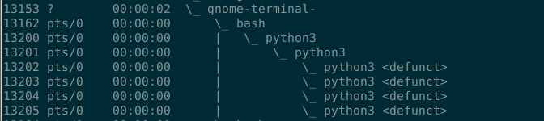
2. отследите какие состояния вы видите у процессов
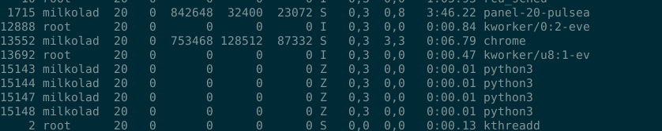
3. почему появляются процессы со статусом Z
+ зомби — это завершившийся процесс, но память о нём всё ещё хранится в ядре. процесс без родителя.
4. какой PID у основного процесса
+ 15097
5. убейте основной процесс ```kill -9 <pid>```
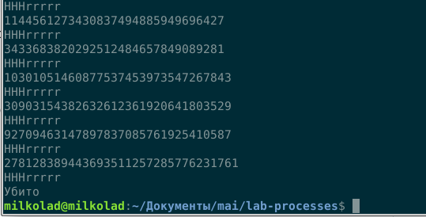
6. какой PPID стал у первого чайлда
+ 15098
7. насколько вы разобрались в скрипте и в том что он делает?
+ Скрипт запускает основной процесс, потом запускает дочерний процесс. Если его PID - 0, то это дочерний процесс. Иначе же - это сам процесс.

---

## Научимся корректно завершать зомби процессы
* запустим еще раз наш процесс
* убьем процесс первого чайлда
* проверим его состояние  и убедимся что он зомби
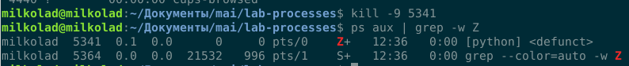
* остановим основной процесс
* расскоментируем строки в скрипте
```python
      pid, status = os.waitpid(pid, 0)
      print("wait returned, pid = %d, status = %d" % (pid, status))
```
* поторим все еще раз
* отследим корректное завершение чайлда
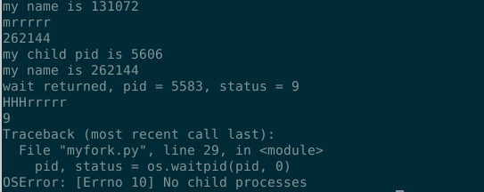

---
## Научимся убивать зомби процессы
* запускаем процессс еще раз
```bash
gdb
> attach <parent_PID>
> call waitpid(zombie_PID, 0, 0) wait
> detach
> quit
```
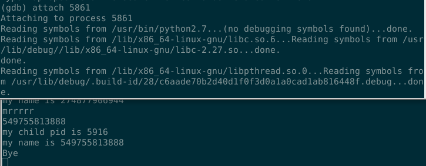
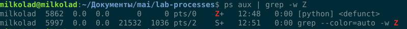
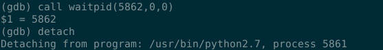
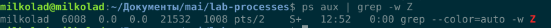

---

## Решаем загадку исчезновения места на диске
* создадим директорию ~/myfiles
* запустим файл test_write.py из ранее созданной директории
* проверим в другом терминале что в этой директории создался файл и он увеличивается в размере
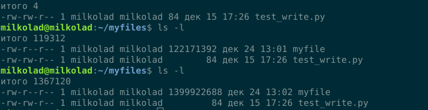
* в первом терминали нажмем Ctrl+Z
* проверим статус файла
* выполним команды
```bash
jobs -l
fg
```
* eще раз остановим  процесс черерз CTRL+Z
* выполним команду ```bg```
* проверим размер файловой системы и каталога
```bash
df 
du -sh  ~/myfiles
```

```bash
Файл.система   1K-блоков Использовано Доступно Использовано% Cмонтировано в
udev             1937236            0  1937236            0% /dev
tmpfs             391980         1736   390244            1% /run
/dev/sda6       82045276     13051120 64783488           17% /
tmpfs            1959888        57720  1902168            3% /dev/shm
tmpfs               5120            4     5116            1% /run/lock
tmpfs            1959888            0  1959888            0% /sys/fs/cgroup
/dev/loop0         55936        55936        0          100% /snap/core18/1279
/dev/loop1          6016         6016        0          100% /snap/tor/2
/dev/loop2        210944       210944        0          100% /snap/gitkraken/146
/dev/loop3         43904        43904        0          100% /snap/gtk-common-themes/1313
/dev/loop4           256          256        0          100% /snap/gtk2-common-themes/5
/dev/loop6         55936        55936        0          100% /snap/core18/1265
/dev/loop7          3840         3840        0          100% /snap/gnome-system-monitor/111
/dev/loop5        177664       177664        0          100% /snap/skype/109
/dev/loop8        151808       151808        0          100% /snap/chromium/971
/dev/loop9         91264        91264        0          100% /snap/core/8213
/dev/loop11         3840         3840        0          100% /snap/gnome-system-monitor/123
/dev/loop10       141056       141056        0          100% /snap/code/23
/dev/loop12       141056       141056        0          100% /snap/code/22
/dev/loop14         1024         1024        0          100% /snap/gnome-logs/81
/dev/loop15       217472       217472        0          100% /snap/tuxguitar-vs/10
/dev/loop13         4224         4224        0          100% /snap/gnome-calculator/406
/dev/loop16       159872       159872        0          100% /snap/gnome-3-28-1804/91
/dev/loop17       211456       211456        0          100% /snap/gitkraken/147
/dev/loop19       157184       157184        0          100% /snap/chromium/958
/dev/loop18        45312        45312        0          100% /snap/gtk-common-themes/1353
/dev/loop20        97408        97408        0          100% /snap/telegram-desktop/994
/dev/loop21       160384       160384        0          100% /snap/blender/34
/dev/loop22        91264        91264        0          100% /snap/core/8268
/dev/loop23       188928       188928        0          100% /snap/tuxguitar-vs/9
/dev/loop24       185472       185472        0          100% /snap/spotify/36
/dev/loop26       177664       177664        0          100% /snap/skype/107
/dev/loop25       160512       160512        0          100% /snap/gnome-3-28-1804/110
/dev/loop27       419328       419328        0          100% /snap/gimp/227
/dev/loop30         4352         4352        0          100% /snap/gnome-calculator/544
/dev/loop29         1024         1024        0          100% /snap/gnome-logs/61
/dev/loop28        15104        15104        0          100% /snap/gnome-characters/367
/dev/loop32       120704       120704        0          100% /snap/blender/33
/dev/loop31        15104        15104        0          100% /snap/gnome-characters/375
/dev/sda7      137007152     73562020 56415836           57% /home
tmpfs             391976           24   391952            1% /run/user/1000
```
```bash
3,6G	/home/milkolad/myfiles
```

* удалим файл
* повторно проверим размеры кталога и файловой системы
```bash
milkolad@milkolad:~/myfiles$ rm myfile
milkolad@milkolad:~/myfiles$ df
Файл.система   1K-блоков Использовано Доступно Использовано% Cмонтировано в
udev             1937236            0  1937236            0% /dev
tmpfs             391980         1728   390252            1% /run
/dev/sda6       82045276     13051124 64783484           17% /
tmpfs            1959888        59000  1900888            4% /dev/shm
tmpfs               5120            4     5116            1% /run/lock
tmpfs            1959888            0  1959888            0% /sys/fs/cgroup
/dev/loop0         55936        55936        0          100% /snap/core18/1279
/dev/loop1          6016         6016        0          100% /snap/tor/2
/dev/loop2        210944       210944        0          100% /snap/gitkraken/146
/dev/loop3         43904        43904        0          100% /snap/gtk-common-themes/1313
/dev/loop4           256          256        0          100% /snap/gtk2-common-themes/5
/dev/loop6         55936        55936        0          100% /snap/core18/1265
/dev/loop7          3840         3840        0          100% /snap/gnome-system-monitor/111
/dev/loop5        177664       177664        0          100% /snap/skype/109
/dev/loop8        151808       151808        0          100% /snap/chromium/971
/dev/loop9         91264        91264        0          100% /snap/core/8213
/dev/loop11         3840         3840        0          100% /snap/gnome-system-monitor/123
/dev/loop10       141056       141056        0          100% /snap/code/23
/dev/loop12       141056       141056        0          100% /snap/code/22
/dev/loop14         1024         1024        0          100% /snap/gnome-logs/81
/dev/loop15       217472       217472        0          100% /snap/tuxguitar-vs/10
/dev/loop13         4224         4224        0          100% /snap/gnome-calculator/406
/dev/loop16       159872       159872        0          100% /snap/gnome-3-28-1804/91
/dev/loop17       211456       211456        0          100% /snap/gitkraken/147
/dev/loop19       157184       157184        0          100% /snap/chromium/958
/dev/loop18        45312        45312        0          100% /snap/gtk-common-themes/1353
/dev/loop20        97408        97408        0          100% /snap/telegram-desktop/994
/dev/loop21       160384       160384        0          100% /snap/blender/34
/dev/loop22        91264        91264        0          100% /snap/core/8268
/dev/loop23       188928       188928        0          100% /snap/tuxguitar-vs/9
/dev/loop24       185472       185472        0          100% /snap/spotify/36
/dev/loop26       177664       177664        0          100% /snap/skype/107
/dev/loop25       160512       160512        0          100% /snap/gnome-3-28-1804/110
/dev/loop27       419328       419328        0          100% /snap/gimp/227
/dev/loop30         4352         4352        0          100% /snap/gnome-calculator/544
/dev/loop29         1024         1024        0          100% /snap/gnome-logs/61
/dev/loop28        15104        15104        0          100% /snap/gnome-characters/367
/dev/loop32       120704       120704        0          100% /snap/blender/33
/dev/loop31        15104        15104        0          100% /snap/gnome-characters/375
/dev/sda7      137007152     78315632 51662224           61% /home
tmpfs             391976           20   391956            1% /run/user/1000
```
```bash
milkolad@milkolad:~/myfiles$ du -sh  ~/myfiles
8,0K	/home/milkolad/myfiles
```

* Какую систуацию вы видите, как вы это объясните
  + Мы запустили скрипт, который в бесконечном цикле пишет что-то в файл
* Подключитесь к процессу через ```strace -p <pid>``` и назовите дескриптор файла, куда пишет процесс
```bash
read(4, "~3E\367\22: \300\t\240 9\272\207\214\257t\356\231J\247\302\364\\\212@\220a\352n\333y"..., 1024) = 1024
write(3, "\305\312\276M\n\244\1\230H\"\231\366?\340\224\n\3628q\242\326\207O\233\35\274\206\37\224\265\0211"..., 4096) = 4096
fstat(4, {st_mode=S_IFCHR|0666, st_rdev=makedev(1, 9), ...}) = 0

```

* проверим какие файлы открыты у нашего процесса через команду lsof -p <pid>
  
```bash
milkolad@milkolad:~/myfiles$ lsof -p 6685
COMMAND  PID     USER   FD   TYPE DEVICE   SIZE/OFF    NODE NAME
python  6685 milkolad  cwd    DIR    8,7       4096 7341041 /home/milkolad/myfiles
python  6685 milkolad  rtd    DIR    8,6       4096       2 /
python  6685 milkolad  txt    REG    8,6    3637096 3147897 /usr/bin/python2.7
python  6685 milkolad  mem    REG    8,6   10281936 3152605 /usr/lib/locale/locale-archive
python  6685 milkolad  mem    REG    8,6    1700792  136442 /lib/x86_64-linux-gnu/libm-2.27.so
python  6685 milkolad  mem    REG    8,6     116960  136551 /lib/x86_64-linux-gnu/libz.so.1.2.11
python  6685 milkolad  mem    REG    8,6      10592  136544 /lib/x86_64-linux-gnu/libutil-2.27.so
python  6685 milkolad  mem    REG    8,6      14560  136402 /lib/x86_64-linux-gnu/libdl-2.27.so
python  6685 milkolad  mem    REG    8,6     144976  136512 /lib/x86_64-linux-gnu/libpthread-2.27.so
python  6685 milkolad  mem    REG    8,6    2030544  136379 /lib/x86_64-linux-gnu/libc-2.27.so
python  6685 milkolad  mem    REG    8,6     170960  136351 /lib/x86_64-linux-gnu/ld-2.27.so
python  6685 milkolad    0u   CHR  136,0        0t0       3 /dev/pts/0
python  6685 milkolad    1u   CHR  136,0        0t0       3 /dev/pts/0
python  6685 milkolad    2u   CHR  136,0        0t0       3 /dev/pts/0
python  6685 milkolad    3w   REG    8,7 9860182016 7341044 /home/milkolad/myfiles/myfile
python  6685 milkolad    4r   CHR    1,9        0t0      11 /dev/urandom
```
* убьем процесс
* еще раз прорим размер файловой системы и каталога
```bash
milkolad@milkolad:~/myfiles$ python test_write.py
0^[[A^[[A[1]+  Убито              python test_write.py
Убито
milkolad@milkolad:~/myfiles$ df
Файл.система   1K-блоков Использовано Доступно Использовано% Cмонтировано в
udev             1937236            0  1937236            0% /dev
tmpfs             391980         1728   390252            1% /run
/dev/sda6       82045276     13051584 64783024           17% /
tmpfs            1959888        59640  1900248            4% /dev/shm
tmpfs               5120            4     5116            1% /run/lock
tmpfs            1959888            0  1959888            0% /sys/fs/cgroup
/dev/loop0         55936        55936        0          100% /snap/core18/1279
/dev/loop1          6016         6016        0          100% /snap/tor/2
/dev/loop2        210944       210944        0          100% /snap/gitkraken/146
/dev/loop3         43904        43904        0          100% /snap/gtk-common-themes/1313
/dev/loop4           256          256        0          100% /snap/gtk2-common-themes/5
/dev/loop6         55936        55936        0          100% /snap/core18/1265
/dev/loop7          3840         3840        0          100% /snap/gnome-system-monitor/111
/dev/loop5        177664       177664        0          100% /snap/skype/109
/dev/loop8        151808       151808        0          100% /snap/chromium/971
/dev/loop9         91264        91264        0          100% /snap/core/8213
/dev/loop11         3840         3840        0          100% /snap/gnome-system-monitor/123
/dev/loop10       141056       141056        0          100% /snap/code/23
/dev/loop12       141056       141056        0          100% /snap/code/22
/dev/loop14         1024         1024        0          100% /snap/gnome-logs/81
/dev/loop15       217472       217472        0          100% /snap/tuxguitar-vs/10
/dev/loop13         4224         4224        0          100% /snap/gnome-calculator/406
/dev/loop16       159872       159872        0          100% /snap/gnome-3-28-1804/91
/dev/loop17       211456       211456        0          100% /snap/gitkraken/147
/dev/loop19       157184       157184        0          100% /snap/chromium/958
/dev/loop18        45312        45312        0          100% /snap/gtk-common-themes/1353
/dev/loop20        97408        97408        0          100% /snap/telegram-desktop/994
/dev/loop21       160384       160384        0          100% /snap/blender/34
/dev/loop22        91264        91264        0          100% /snap/core/8268
/dev/loop23       188928       188928        0          100% /snap/tuxguitar-vs/9
/dev/loop24       185472       185472        0          100% /snap/spotify/36
/dev/loop26       177664       177664        0          100% /snap/skype/107
/dev/loop25       160512       160512        0          100% /snap/gnome-3-28-1804/110
/dev/loop27       419328       419328        0          100% /snap/gimp/227
/dev/loop30         4352         4352        0          100% /snap/gnome-calculator/544
/dev/loop29         1024         1024        0          100% /snap/gnome-logs/61
/dev/loop28        15104        15104        0          100% /snap/gnome-characters/367
/dev/loop32       120704       120704        0          100% /snap/blender/33
/dev/loop31        15104        15104        0          100% /snap/gnome-characters/375
/dev/sda7      137007152     82226260 47751596           64% /home
tmpfs             391976           20   391956            1% /run/user/1000
milkolad@milkolad:~/myfiles$ du -sh  ~/myfiles
9,8G	/home/milkolad/myfiles
```
* Напишите свое объяснение, что произошло
  + Мы завершили процесс, который писал в файл

---

## Утилиты наблюдения
* C помощью утилит мониторинга 
* проверьте текущий LA
```bash
milkolad@milkolad:~/myfiles$ uptime
 13:27:58 up  1:13,  1 user,  load average: 1,27, 1,28, 1,39
```
* запишите top 3 процессов загружающих CPU
```bash
 4584 milkolad  20   0  731664  55136  29708 S   5,9  1,4   1:43.72 gnome-ter+ 
 1503 milkolad  20   0  465776  69484  50564 S   5,3  1,8   5:33.80 Xorg       
 7474 milkolad  20   0   51392   4260   3560 R   1,3  0,1   0:00.39 top
 ```
* запишите top 3 процессов загружающих память
```bash
2949 milkolad  20   0 1135292 252548 123404 S   2,6  6,4   4:10.01 chrome     
 3109 milkolad  20   0  943708 206816  68616 S   0,0  5,3   0:23.75 chrome     
 7080 milkolad  20   0  856504 174312  91776 S   1,0  4,4   0:31.35 chrome
 ```
* запустите dd на генерацию файла размер в 3 гигабайта
  + dd of=file bs=1 count=0 seek=3G
* удалите сгенеренный файл
* Проанализируйте нагрузку на диск через утилиты  iotop и iostat
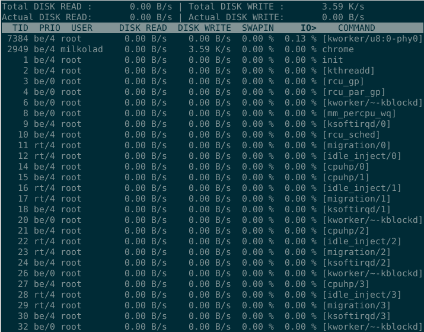
